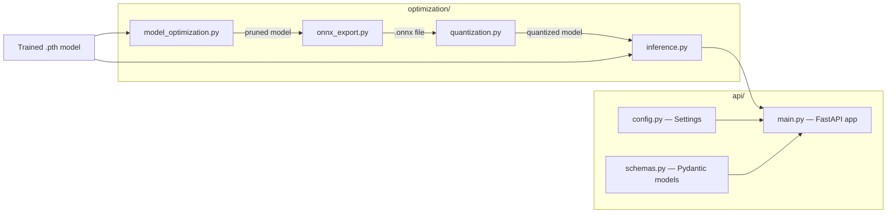

# Deployment Package

> Model optimization, inference engines, and REST API for production deployment of LSTM_PFD bearing fault diagnosis models.

## Overview

The `packages/deployment/` package provides two core subsystems:

1. **`api/`** — FastAPI-based REST API for real-time and batch inference
2. **`optimization/`** — Model optimization pipeline: ONNX export, quantization (INT8/FP16), pruning, and high-performance inference engines

Together they form the complete model-serving stack: optimize a trained PyTorch model, export it, and serve predictions via a REST API.

## Architecture



## Quick Start

```python
from deployment.optimization import (
    export_to_onnx,
    quantize_model_dynamic,
    OptimizedInferenceEngine,
    InferenceConfig,
)
import torch

# 1. Load a trained model
model = torch.load("checkpoints/best_model.pth")
model.eval()

# 2. Export to ONNX
dummy_input = torch.randn(1, 1, 2048)  # [batch, channels, signal_length]
export_to_onnx(model, dummy_input, "models/model.onnx")

# 3. Or quantize for faster CPU inference
quantized = quantize_model_dynamic(model)

# 4. Run inference via the unified engine
engine = OptimizedInferenceEngine(InferenceConfig(device="cpu"))
engine.load_model("checkpoints/best_model.pth")
predictions = engine.predict(input_data)  # numpy array [B, 1, T]
```

## Key Components

| Component                   | File                                 | Description                                                                    |
| --------------------------- | ------------------------------------ | ------------------------------------------------------------------------------ |
| `OptimizedInferenceEngine`  | `optimization/inference.py`          | Unified engine — auto-selects best backend (PyTorch or ONNX)                   |
| `TorchInferenceEngine`      | `optimization/inference.py`          | PyTorch inference with FP32, FP16, and quantized model support                 |
| `ONNXInferenceEngine`       | `optimization/inference.py`          | ONNX Runtime inference with auto-detected execution providers                  |
| `export_to_onnx`            | `optimization/onnx_export.py`        | Export PyTorch model to ONNX with configurable opset version                   |
| `validate_onnx_export`      | `optimization/onnx_export.py`        | Compare ONNX output vs PyTorch output to verify correctness                    |
| `optimize_onnx_model`       | `optimization/onnx_export.py`        | Graph-level ONNX optimization (constant folding, fusions)                      |
| `ONNXInferenceSession`      | `optimization/onnx_export.py`        | Lightweight ONNX Runtime wrapper for direct inference                          |
| `convert_and_quantize_onnx` | `optimization/onnx_export.py`        | End-to-end: export to ONNX + dynamic INT8 quantization                         |
| `quantize_model_dynamic`    | `optimization/quantization.py`       | Dynamic INT8 quantization (Linear, LSTM, GRU layers)                           |
| `quantize_model_static`     | `optimization/quantization.py`       | Static INT8 quantization with calibration data                                 |
| `quantize_to_fp16`          | `optimization/quantization.py`       | FP16 half-precision conversion                                                 |
| `prepare_qat_model`         | `optimization/quantization.py`       | Prepare model for Quantization-Aware Training                                  |
| `quantize_qat_model`        | `optimization/quantization.py`       | Convert QAT-trained model to fully quantized                                   |
| `prune_model`               | `optimization/model_optimization.py` | Weight pruning (L1 unstructured, L1 structured, random)                        |
| `fuse_model_layers`         | `optimization/model_optimization.py` | Layer fusion (Conv+BN+ReLU); currently model-specific stub                     |
| `optimize_for_deployment`   | `optimization/model_optimization.py` | Combined pipeline: pruning + fusion at light/standard/aggressive levels        |
| `calculate_model_stats`     | `optimization/model_optimization.py` | Model statistics: params, sparsity, memory, layer breakdown                    |
| `profile_model`             | `optimization/model_optimization.py` | FLOPs / MACs profiling (requires `torchprofile`)                               |
| `FastAPI app`               | `api/main.py`                        | REST API with `/predict`, `/predict/batch`, `/health`, `/model/info` endpoints |
| `Settings`                  | `api/config.py`                      | Pydantic-based config loaded from env vars / `.env`                            |
| Request/Response schemas    | `api/schemas.py`                     | `PredictionRequest`, `PredictionResponse`, `BatchPredictionRequest`, etc.      |

## API Endpoints

| Method | Path             | Description                              | Auth     |
| ------ | ---------------- | ---------------------------------------- | -------- |
| `GET`  | `/`              | Welcome message with links               | No       |
| `GET`  | `/health`        | Service health + model status            | No       |
| `GET`  | `/model/info`    | Model metadata, class names, input shape | Optional |
| `POST` | `/predict`       | Single signal prediction                 | Optional |
| `POST` | `/predict/batch` | Batch prediction (up to 128 signals)     | Optional |

Authentication is via `X-API-Key` header when `REQUIRE_AUTHENTICATION=True`.

### Request / Response Schemas

**`POST /predict`**

```json
// Request
{
  "signal": [0.1, 0.2, ...],      // float array, length must match SIGNAL_LENGTH
  "return_probabilities": true,     // include per-class probabilities
  "return_top_k": 3                 // optional: return only top K classes
}

// Response
{
  "predicted_class": 0,
  "class_name": "Normal",
  "confidence": 0.97,
  "probabilities": {"Normal": 0.97, "Inner Race": 0.02, ...},
  "inference_time_ms": 12.5,
  "timestamp": "2026-01-15T10:30:00Z"
}
```

**`POST /predict/batch`**

```json
// Request
{
  "signals": [[0.1, ...], [0.2, ...]],
  "return_probabilities": true
}

// Response
{
  "predictions": [/* array of PredictionResponse */],
  "batch_size": 2,
  "total_inference_time_ms": 25.0,
  "average_inference_time_ms": 12.5
}
```

## Optimization Workflows

### ONNX Export Pipeline

```python
from deployment.optimization.onnx_export import (
    export_to_onnx, validate_onnx_export, optimize_onnx_model,
    ONNXExportConfig
)

# Configure export
config = ONNXExportConfig(
    opset_version=14,
    do_constant_folding=True,
    dynamic_axes={"input": {0: "batch_size"}, "output": {0: "batch_size"}}
)

# Export
onnx_path = export_to_onnx(model, dummy_input, "models/model.onnx", config)

# Validate (compare outputs within tolerance)
is_valid = validate_onnx_export("models/model.onnx", model, dummy_input)

# Optimize graph
optimized_path = optimize_onnx_model("models/model.onnx", "models/model_opt.onnx", "all")
```

### Quantization Pipeline

```python
from deployment.optimization.quantization import (
    quantize_model_dynamic,
    quantize_model_static,
    quantize_to_fp16,
    compare_model_sizes,
    benchmark_quantized_model,
)

# Dynamic quantization (no calibration data needed — best for LSTM/Linear)
q_dynamic = quantize_model_dynamic(model, dtype=torch.qint8)

# Static quantization (needs calibration data — best for CNNs)
q_static = quantize_model_static(model, calibration_loader, backend="fbgemm")

# FP16 conversion (for GPU inference with Tensor Cores)
fp16_model = quantize_to_fp16(model)

# Compare sizes
stats = compare_model_sizes(model, q_dynamic)
# → {'compression_ratio': ..., 'size_reduction_percent': ...}
```

### Pruning Pipeline

```python
from deployment.optimization.model_optimization import (
    prune_model,
    optimize_for_deployment,
    calculate_model_stats,
)

# Prune 30% of weights (L1 unstructured)
pruned = prune_model(model, pruning_amount=0.3, pruning_type="l1_unstructured")

# Or use combined optimization
optimized = optimize_for_deployment(model, optimization_level="aggressive")
# → Prunes 50%, attempts layer fusion

# Get stats
stats = calculate_model_stats(optimized)
# → {'total_params': ..., 'sparsity': ..., 'size_mb': ...}
```

## Dependencies

- **Requires:** `torch`, `numpy`, `fastapi`, `pydantic`, `pydantic_settings`, `uvicorn`
- **Optional:** `onnx`, `onnxruntime` (for ONNX export/inference), `torchprofile` (for FLOPs profiling)
- **Internal:** `utils.constants` (for `NUM_CLASSES`, `SIGNAL_LENGTH`, `FAULT_TYPES`)

## Performance

> ⚠️ **Results pending.** Performance metrics below will be populated after experiments are run on the current codebase.

| Metric                                   | Value       |
| ---------------------------------------- | ----------- |
| Inference Latency (PyTorch, CPU)         | `[PENDING]` |
| Inference Latency (ONNX, CPU)            | `[PENDING]` |
| Model Size (FP32)                        | `[PENDING]` |
| Model Size (INT8 Dynamic)                | `[PENDING]` |
| Model Size (FP16)                        | `[PENDING]` |
| Compression Ratio (dynamic quantization) | `[PENDING]` |
| Pruning Speedup (30% sparsity)           | `[PENDING]` |

## Testing

```bash
# Run the API server locally for development
uvicorn packages.deployment.api.main:app --reload

# Run inference benchmark (ONNX only currently)
python -c "
from deployment.optimization.inference import benchmark_inference
results = benchmark_inference('models/model.onnx', (1, 1, 2048), backends=['onnx'])
"
```

## Related Documentation

- [Deploy README](../../deploy/README.md) — Infrastructure overview (Docker, K8s, Helm)
- [Deployment Guide](../../deploy/DEPLOYMENT_GUIDE.md) — Step-by-step deployment instructions
