# Testing Suite

> Comprehensive pytest-based test suite for the LSTM-PFD bearing fault diagnosis system.

## Overview

The test suite validates every layer of the system — from individual model forward passes to full end-to-end training pipelines, stress/load testing, and deployment verification. Tests are organized by category in dedicated subdirectories, with shared fixtures and custom markers defined in `conftest.py`.

## Architecture

```mermaid
graph TD
    A[tests/] --> B[conftest.py<br>Shared Fixtures & Markers]
    A --> C[Root-Level Tests]
    A --> D[unit/]
    A --> E[integration/]
    A --> F[benchmarks/]
    A --> G[stress_tests.py]
    A --> H[load_tests.py]
    A --> I[models/]
    A --> J[utilities/]

    C --> C1[test_models.py]
    C --> C2[test_all_models.py]
    C --> C3[test_classical_models.py]
    C --> C4[test_pinn.py]
    C --> C5[test_data_generation.py]
    C --> C6[test_feature_engineering.py]
    C --> C7[test_evaluation_pipeline.py]
    C --> C8[test_deployment.py]
    C --> C9[test_dashboard_sanity.py]
    C --> C10[test_xai.py]
    C --> C11[test_phase1_verify.py]

    D --> D1[test_api.py]
    D --> D2[test_deployment.py]
    D --> D3[test_fault_consistency.py]
    D --> D4[test_features.py]

    E --> E1[test_comprehensive.py]
    E --> E2[test_pipelines.py]

    F --> F1[benchmark_suite.py]

    I --> I1[simple_cnn.py<br>Test Model]

    J --> J1[test_bug_fixes.py]
    J --> J2[test_phase8_fixes.py]
```



## Test Structure

| Category              | Directory/File          | File Count | Description                                                                                                                                 |
| --------------------- | ----------------------- | ---------- | ------------------------------------------------------------------------------------------------------------------------------------------- |
| **Root-Level Tests**  | `tests/test_*.py`       | 11         | Core component tests: models, data generation, features, evaluation, deployment, dashboard, XAI                                             |
| **Unit Tests**        | `tests/unit/`           | 4          | Focused component tests: API schemas/endpoints, deployment optimization, fault type consistency, feature extraction/normalization/selection |
| **Integration Tests** | `tests/integration/`    | 2          | End-to-end pipeline tests: full training loops, checkpoint save/load, streaming dataloader, cross-validation, ensemble pipelines            |
| **Stress Tests**      | `tests/stress_tests.py` | 1          | Large batch processing, memory leak detection, GPU memory stress, concurrent inference                                                      |
| **Load Tests**        | `tests/load_tests.py`   | 1          | Concurrent API request simulation, resource monitoring, bottleneck identification                                                           |
| **Benchmarks**        | `tests/benchmarks/`     | 1          | Feature extraction, model inference, quantized model, API latency, memory usage benchmarks                                                  |
| **Test Models**       | `tests/models/`         | 1          | `SimpleCNN` — lightweight test-only model for fixtures                                                                                      |
| **Utilities**         | `tests/utilities/`      | 2          | Phase 0 bug fix verification, Phase 8 ensemble fix verification                                                                             |

**Total:** 23 test files + 4 support files (`conftest.py`, `__init__.py` files, `simple_cnn.py`)

## Running Tests

```bash
# Run entire test suite
pytest tests/

# Run with verbose output
pytest tests/ -v

# Run specific test category
pytest tests/unit/ -v
pytest tests/integration/ -v

# Run by marker
pytest tests/ -m unit
pytest tests/ -m integration
pytest tests/ -m "not slow"
pytest tests/ -m "not gpu"

# Run a specific test file
pytest tests/test_models.py -v
pytest tests/test_pinn.py -v

# Run with coverage
pytest tests/ --cov=packages/ --cov-report=html

# Run stress tests with custom parameters
pytest tests/stress_tests.py --stress-duration 60 --stress-samples 5000

# Run benchmarks standalone
python tests/benchmarks/benchmark_suite.py --output results/benchmarks.json

# Run Phase 1 verification (standalone script)
python tests/test_phase1_verify.py

# Run bug fix verification (standalone scripts)
python tests/utilities/test_bug_fixes.py
python tests/utilities/test_phase8_fixes.py
```

## Coverage

> ⚠️ **Results pending.** Run the coverage command to get current numbers.

```bash
pytest tests/ --cov=packages/ --cov-report=html
# Coverage report: [RUN pytest --cov TO CHECK]
```

## Key Fixtures (`conftest.py`)

| Fixture                    | Scope      | Description                                                                              |
| -------------------------- | ---------- | ---------------------------------------------------------------------------------------- |
| `device`                   | `session`  | Returns `torch.device("cuda")` if available, else `"cpu"`                                |
| `sample_signal`            | `function` | Single 1024-point simulated bearing vibration signal (base frequency + harmonic + noise) |
| `sample_batch_signals`     | `function` | Batch of 32 signals with 11 fault-type labels (1024 points each)                         |
| `sample_features`          | `function` | 100 × 15 random feature matrix with integer labels (0 to `NUM_CLASSES`)                  |
| `temp_checkpoint_dir`      | `function` | Temporary directory for model checkpoints (auto-cleaned)                                 |
| `temp_data_dir`            | `function` | Temporary directory for data files (auto-cleaned)                                        |
| `mock_h5_cache`            | `function` | Pre-populated HDF5 cache file with signals, labels, and metadata                         |
| `simple_cnn_model`         | `function` | `SimpleCNN` instance from `tests.models` (picklable for ONNX tests)                      |
| `trained_model_checkpoint` | `function` | Saved `.pth` checkpoint with model state dict, epoch, accuracy, and metadata             |

## Custom Markers

| Marker                     | Description                          |
| -------------------------- | ------------------------------------ |
| `@pytest.mark.unit`        | Unit tests for individual components |
| `@pytest.mark.integration` | Integration tests for pipelines      |
| `@pytest.mark.benchmark`   | Performance benchmarks               |
| `@pytest.mark.slow`        | Slow tests (>1 second)               |
| `@pytest.mark.gpu`         | Tests requiring GPU                  |

Markers are registered in `conftest.py` via `pytest_configure()`.

## Dependencies

- **Requires:**
  - `pytest` — test runner
  - `torch`, `numpy`, `h5py` — core test dependencies (used by most fixtures)
  - `scikit-learn` — classical model tests and integration pipelines
  - `psutil` — resource monitoring in load tests (optional; degrades gracefully)
  - `requests` — HTTP load testing (optional; degrades gracefully)
  - `fastapi`, `httpx` — API endpoint tests (skipped if not installed)
  - `onnx`, `onnxruntime` — ONNX export tests (skipped if not installed)
- **Provides:** Test coverage and validation for all `packages/core/`, `packages/deployment/`, `packages/dashboard/`, `data/`, `api/`, and `utils/` modules

## Related Documentation

- [TESTING_GUIDE.md](./TESTING_GUIDE.md) — Detailed guide for writing tests, fixture usage, mocking patterns, and CI/CD integration
- [Signal Generation README](../data/SIGNAL_GENERATION_README.md) — Context for `test_data_generation.py`
- [Models README](../packages/core/models/README.md) — Context for `test_models.py`, `test_all_models.py`, `test_pinn.py`
- [Features README](../packages/core/features/README.md) — Context for `test_feature_engineering.py`
- [Deployment README](../packages/deployment/README.md) — Context for `test_deployment.py`
