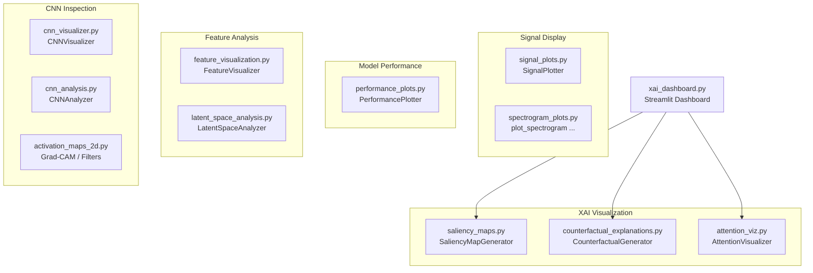

# Visualization

> Publication-quality plotting and explainability visualization for bearing fault diagnosis models.

## Overview

The `visualization/` module provides a comprehensive suite of plotting tools for analysing, interpreting, and presenting results from the LSTM-PFD bearing fault diagnosis system. It covers three broad areas:

1. **Signal & Spectrogram Display** — time-domain waveforms, frequency spectra, STFT/CWT/WVD spectrograms.
2. **Model Performance** — confusion matrices, ROC curves, model comparison bar charts.
3. **Explainability (XAI)** — saliency maps, Grad-CAM, attention heatmaps, counterfactual explanations, latent-space projections, and an interactive Streamlit dashboard.

All visualisations are built on **Matplotlib** and **Seaborn**, with optional **UMAP** support for dimensionality reduction and **Streamlit** for the interactive dashboard.

## Architecture



## Quick Start

```python
from visualization import FeatureVisualizer, PerformancePlotter, SignalPlotter

# Plot time-domain + frequency-domain + spectrogram for sample signals
fig = SignalPlotter.plot_signal_examples(
    signals, labels, fs=20480, n_examples=3, save_path="signals.png"
)

# Confusion matrix
fig = PerformancePlotter.plot_confusion_matrix(
    cm, class_names=class_names, normalize=True, save_path="cm.png"
)

# t-SNE feature clustering
FeatureVisualizer.plot_tsne_clusters(
    features, labels, save_path="tsne.png", perplexity=30
)
```

## Visualization Catalog

| Category     | Visualization                     | File                             | Primary Class / Function                                   | Input                            | Output                     |
| ------------ | --------------------------------- | -------------------------------- | ---------------------------------------------------------- | -------------------------------- | -------------------------- |
| Signal       | Time + Frequency + Spectrogram    | `signal_plots.py`                | `SignalPlotter.plot_signal_examples`                       | `np.ndarray` signals, labels, fs | matplotlib `Figure`        |
| Signal       | Signal comparison                 | `signal_plots.py`                | `SignalPlotter.plot_signal_comparison`                     | Two `np.ndarray` signals, fs     | matplotlib `Figure`        |
| Spectrogram  | Single spectrogram                | `spectrogram_plots.py`           | `plot_spectrogram`                                         | `np.ndarray` [H, W]              | matplotlib `Axes`          |
| Spectrogram  | STFT / CWT / WVD comparison       | `spectrogram_plots.py`           | `plot_spectrogram_comparison`                              | `np.ndarray` signal, fs          | matplotlib `Figure`        |
| Spectrogram  | Fault grid                        | `spectrogram_plots.py`           | `plot_fault_spectrograms_grid`                             | `Dict[str, np.ndarray]`          | matplotlib `Figure`        |
| Spectrogram  | With prediction overlay           | `spectrogram_plots.py`           | `plot_spectrogram_with_prediction`                         | signal, labels, confidence       | matplotlib `Figure`        |
| Spectrogram  | Frequency band evolution          | `spectrogram_plots.py`           | `plot_frequency_evolution`                                 | signal, freq_bands               | matplotlib `Figure`        |
| Spectrogram  | Per-class statistics              | `spectrogram_plots.py`           | `plot_spectrogram_statistics`                              | spectrograms, labels             | matplotlib `Figure`        |
| Performance  | Model accuracy comparison         | `performance_plots.py`           | `PerformancePlotter.plot_model_comparison`                 | results `Dict`                   | matplotlib `Figure`        |
| Performance  | Confusion matrix                  | `performance_plots.py`           | `PerformancePlotter.plot_confusion_matrix`                 | `np.ndarray` cm                  | matplotlib `Figure`        |
| Performance  | ROC curves (OvR)                  | `performance_plots.py`           | `PerformancePlotter.plot_roc_curves`                       | y_true, y_proba                  | matplotlib `Figure`        |
| Feature      | Correlation heatmap               | `feature_visualization.py`       | `FeatureVisualizer.plot_correlation_matrix`                | features, names                  | matplotlib `Figure`        |
| Feature      | Distribution by class             | `feature_visualization.py`       | `FeatureVisualizer.plot_feature_distributions`             | features, labels                 | matplotlib `Figure`        |
| Feature      | t-SNE clustering                  | `feature_visualization.py`       | `FeatureVisualizer.plot_tsne_clusters`                     | features, labels                 | matplotlib `Figure`        |
| Feature      | UMAP clustering                   | `feature_visualization.py`       | `FeatureVisualizer.plot_umap_clusters`                     | features, labels                 | matplotlib `Figure`        |
| Feature      | Side-by-side embedding comparison | `feature_visualization.py`       | `FeatureVisualizer.compare_embeddings`                     | two feature sets, labels         | matplotlib `Figure`        |
| Feature      | Clustering quality metrics        | `feature_visualization.py`       | `FeatureVisualizer.compute_clustering_metrics`             | features, labels                 | `Dict`                     |
| Latent Space | Feature extraction from model     | `latent_space_analysis.py`       | `LatentSpaceAnalyzer.extract_features`                     | model, dataloader                | `(np.ndarray, np.ndarray)` |
| Latent Space | Side-by-side 2D projection        | `latent_space_analysis.py`       | `LatentSpaceAnalyzer.plot_comparison`                      | two feature sets, labels         | matplotlib `Figure`        |
| Latent Space | Single projection                 | `latent_space_analysis.py`       | `LatentSpaceAnalyzer.plot_single`                          | features, labels                 | matplotlib `Figure`        |
| Latent Space | Comparison report                 | `latent_space_analysis.py`       | `LatentSpaceAnalyzer.print_comparison_report`              | two feature sets, labels         | stdout                     |
| CNN (1D)     | Filter visualization              | `cnn_visualizer.py`              | `CNNVisualizer.plot_conv_filters`                          | — (reads model weights)          | matplotlib `Figure`        |
| CNN (1D)     | Feature maps                      | `cnn_visualizer.py`              | `CNNVisualizer.plot_feature_maps`                          | input signal tensor              | matplotlib `Figure`        |
| CNN (1D)     | Activation distributions          | `cnn_visualizer.py`              | `CNNVisualizer.plot_activation_distributions`              | input signal tensor              | `Dict` + `Figure`          |
| CNN (1D)     | Filter heatmap                    | `cnn_visualizer.py`              | `CNNVisualizer.plot_filter_heatmap`                        | layer name                       | `np.ndarray` + `Figure`    |
| CNN (1D)     | Receptive field                   | `cnn_visualizer.py`              | `CNNVisualizer.plot_receptive_field`                       | —                                | `Dict` + `Figure`          |
| CNN (1D)     | Gradient flow                     | `cnn_analysis.py`                | `CNNAnalyzer.analyze_gradient_flow`                        | dataloader                       | matplotlib `Figure`        |
| CNN (1D)     | Input saliency (gradient)         | `cnn_analysis.py`                | `CNNAnalyzer.compute_saliency_map`                         | input tensor, target class       | `np.ndarray` + `Figure`    |
| CNN (1D)     | Occlusion sensitivity             | `cnn_analysis.py`                | `CNNAnalyzer.occlusion_sensitivity`                        | input tensor, target class       | `Figure`                   |
| CNN (1D)     | Failure case analysis             | `cnn_analysis.py`                | `CNNAnalyzer.analyze_failure_cases`                        | dataloader, class names          | `Figure`                   |
| CNN (1D)     | Layer ablation study              | `cnn_analysis.py`                | `CNNAnalyzer.layer_ablation_study`                         | dataloader                       | `Dict` + `Figure`          |
| CNN (2D)     | Filter visualization              | `activation_maps_2d.py`          | `visualize_filters`                                        | model, layer name                | matplotlib `Figure`        |
| CNN (2D)     | Feature maps                      | `activation_maps_2d.py`          | `visualize_feature_maps`                                   | model, spectrogram tensor        | matplotlib `Figure`        |
| CNN (2D)     | Grad-CAM heatmap                  | `activation_maps_2d.py`          | `visualize_grad_cam`                                       | model, spectrogram tensor        | matplotlib `Figure`        |
| CNN (2D)     | Layer response analysis           | `activation_maps_2d.py`          | `analyze_layer_responses`                                  | model, spectrogram, layers       | matplotlib `Figure`        |
| CNN (2D)     | Filter frequency response         | `activation_maps_2d.py`          | `visualize_filter_responses_to_frequency`                  | model, spectrograms              | matplotlib `Figure`        |
| XAI          | Vanilla gradient saliency         | `saliency_maps.py`               | `SaliencyMapGenerator.vanilla_gradient`                    | input tensor                     | saliency `Tensor`          |
| XAI          | SmoothGrad saliency               | `saliency_maps.py`               | `SaliencyMapGenerator.smooth_grad`                         | input tensor                     | saliency `Tensor`          |
| XAI          | Gradient × Input                  | `saliency_maps.py`               | `SaliencyMapGenerator.gradient_times_input`                | input tensor                     | saliency `Tensor`          |
| XAI          | GradCAM 1D                        | `saliency_maps.py`               | `SaliencyMapGenerator.grad_cam_1d`                         | input tensor                     | saliency `Tensor`          |
| XAI          | Saliency overlay plot             | `saliency_maps.py`               | `plot_saliency_map`                                        | signal, saliency                 | matplotlib `Figure`        |
| XAI          | Multi-method comparison           | `saliency_maps.py`               | `compare_saliency_methods`                                 | signal, generator                | matplotlib `Figure`        |
| XAI          | Counterfactual generation         | `counterfactual_explanations.py` | `CounterfactualGenerator.generate`                         | signal tensor, target class      | `(Tensor, Dict)`           |
| XAI          | Diverse counterfactuals           | `counterfactual_explanations.py` | `CounterfactualGenerator.generate_diverse_counterfactuals` | signal, target, count            | `List[Tuple]`              |
| XAI          | Counterfactual plot               | `counterfactual_explanations.py` | `plot_counterfactual_explanation`                          | original, counterfactual         | matplotlib `Figure`        |
| XAI          | Optimization history              | `counterfactual_explanations.py` | `plot_optimization_history`                                | history `Dict`                   | matplotlib `Figure`        |
| XAI          | Attention heatmap                 | `attention_viz.py`               | `AttentionVisualizer.plot_attention_heatmap`               | input tensor                     | matplotlib `Figure`        |
| XAI          | Signal attention overlay          | `attention_viz.py`               | `AttentionVisualizer.plot_signal_attention`                | signal, input tensor             | matplotlib `Figure`        |
| XAI          | Head comparison                   | `attention_viz.py`               | `AttentionVisualizer.plot_head_comparison`                 | input tensor                     | matplotlib `Figure`        |
| XAI          | Attention rollout                 | `attention_viz.py`               | `AttentionVisualizer.attention_rollout`                    | attention weights list           | rolled `Tensor`            |
| Dashboard    | Interactive XAI explorer          | `xai_dashboard.py`               | `main`                                                     | — (Streamlit app)                | Web UI                     |

## Key Components

| Component                 | Description                                                               | File                             |
| ------------------------- | ------------------------------------------------------------------------- | -------------------------------- |
| `SignalPlotter`           | Time-domain, frequency-domain, and spectrogram signal plots               | `signal_plots.py`                |
| `PerformancePlotter`      | Model comparison bar charts, confusion matrices, ROC curves               | `performance_plots.py`           |
| `FeatureVisualizer`       | Correlation heatmaps, feature distributions, t-SNE/UMAP clustering        | `feature_visualization.py`       |
| `LatentSpaceAnalyzer`     | Physics-vs-data branch latent space comparison with clustering metrics    | `latent_space_analysis.py`       |
| `CNNVisualizer`           | 1D CNN filter, feature map, activation, and receptive field visualization | `cnn_visualizer.py`              |
| `CNNAnalyzer`             | 1D CNN gradient flow, saliency, occlusion sensitivity, ablation study     | `cnn_analysis.py`                |
| `SaliencyMapGenerator`    | Vanilla gradient, SmoothGrad, Gradient×Input, GradCAM-1D                  | `saliency_maps.py`               |
| `CounterfactualGenerator` | Optimization-based counterfactual explanation generation                  | `counterfactual_explanations.py` |
| `AttentionVisualizer`     | Transformer attention weight extraction and visualization                 | `attention_viz.py`               |
| 2D Activation Maps        | Filter, feature map, Grad-CAM for spectrogram-based 2D CNNs               | `activation_maps_2d.py`          |
| Spectrogram Plots         | STFT/CWT/WVD plotting, fault grids, frequency evolution                   | `spectrogram_plots.py`           |
| XAI Dashboard             | Streamlit-based interactive explorer for all XAI methods                  | `xai_dashboard.py`               |

## API Summary

See [VISUALIZATION_GUIDE.md](VISUALIZATION_GUIDE.md) for detailed usage of each component including constructor parameters, method signatures, and customization options.

## Dependencies

- **Requires:**
  - `matplotlib`, `seaborn` — core plotting
  - `numpy`, `torch` — data handling and model inference
  - `scikit-learn` — t-SNE, clustering metrics, ROC curves
  - `scipy` — FFT, spectrogram computation
  - `umap-learn` (optional) — UMAP dimensionality reduction
  - `streamlit` (optional) — interactive XAI dashboard
  - `packages/core/models/` — model classes for CNN / Transformer inspection
  - `packages/core/explainability/` — SHAP, LIME, uncertainty (used by dashboard)
  - `data/` — `SpectrogramGenerator`, `WaveletTransform`, `generate_wvd`
  - `utils/constants` — `NUM_CLASSES`, `SIGNAL_LENGTH`, `SAMPLING_RATE`

- **Provides:**
  - `FeatureVisualizer`, `PerformancePlotter`, `SignalPlotter` (exported via `__init__.py`)
  - `SaliencyMapGenerator`, `plot_saliency_map`, `compare_saliency_methods` (exported via `__init__.py`)
  - `CounterfactualGenerator`, `plot_counterfactual_explanation`, `plot_optimization_history` (exported via `__init__.py`)

## Configuration

Publication-quality matplotlib defaults are set in `feature_visualization.py`:

```python
plt.rcParams.update({
    'font.size': 12,
    'axes.labelsize': 14,
    'axes.titlesize': 16,
    'xtick.labelsize': 11,
    'ytick.labelsize': 11,
    'legend.fontsize': 11,
    'figure.figsize': (10, 8),
    'figure.dpi': 150
})
```

Individual visualizers accept `figsize` and `save_path` parameters for per-call customization.

## Output Formats

All matplotlib-based visualisations support PNG, PDF, and SVG output via the `save_path` parameter. The format is inferred from the file extension:

```python
# PNG (default for raster)
plotter.plot_confusion_matrix(cm, save_path="cm.png")

# PDF (vector, publication quality)
plotter.plot_confusion_matrix(cm, save_path="cm.pdf")

# SVG (vector, web-friendly)
plotter.plot_confusion_matrix(cm, save_path="cm.svg")
```

Default DPI is **150** for saved figures.

## Testing

Each module includes an `if __name__ == '__main__':` block with test/demo code:

```bash
python -m visualization.feature_visualization
python -m visualization.attention_viz
python -m visualization.cnn_analysis
python -m visualization.cnn_visualizer
python -m visualization.saliency_maps
python -m visualization.counterfactual_explanations
python -m visualization.spectrogram_plots
python -m visualization.activation_maps_2d
```

## Performance

> ⚠️ **Results pending.** Performance metrics below will be populated
> after experiments are run on the current codebase.

| Metric                             | Value       |
| ---------------------------------- | ----------- |
| Average plot generation time       | `[PENDING]` |
| Memory footprint per visualization | `[PENDING]` |

## Related Documentation

- [Explainability (XAI) Guide](../packages/core/explainability/XAI_GUIDE.md) — IDB 1.5
- [Signal Generation](../data/SIGNAL_GENERATION_README.md) — IDB 3.1
- [Data Loading](../data/DATA_LOADING_README.md) — IDB 3.2
- [Storage / HDF5](../data/HDF5_GUIDE.md) — IDB 3.3
- [Research Scripts](../scripts/research/README.md) — IDB 5.1
